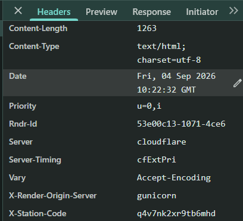
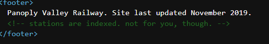
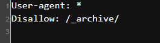
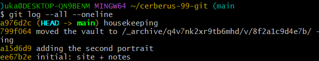
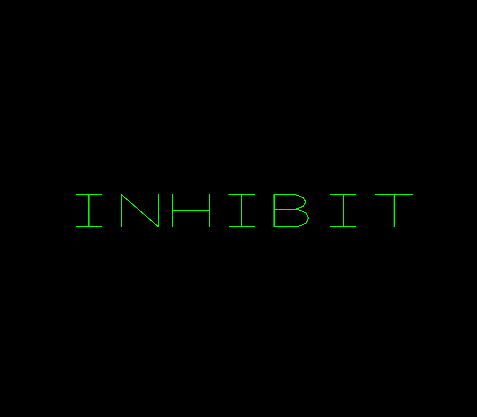
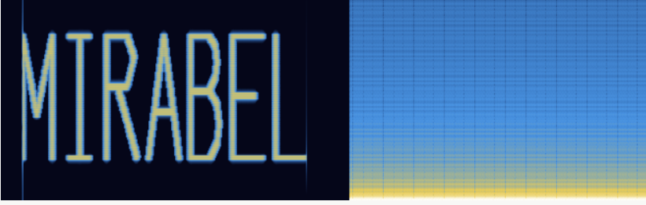
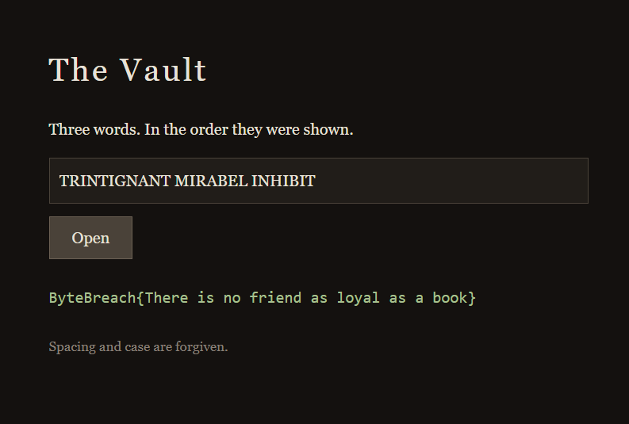

# Beyond Machines ByteBreach Challenge Writeup

As a preface I want to mention that this is my first time doing something of this nature and I heavily used AI to help myself out when I got stuck!

Reading the website and the rules and what the challenge is, my eyes immediately went to the painting. Upon further inspection I noticed a lot of intricate details and while browsing the photo I found the first clue. Recently I built a website for a friend and while searching on how to host it I decided to use Vercel but I also learnt about Render so combining "panoplyvalley" and "onrender.com" I reached the station :D.

Upon landing on the new url and reading everything I couldn't seem to find the next clue so I used inspect and view page source to find out if there is any network traffic or other hidden things. Upon reading the network headers I noticed a custom response header labeled x-station-code:

Viewing the page source I found another hint

Hinting at the fact that ai-agents cant read from robots.txt, so I checked myself and fount this:

After checking https://panoplyvalley.onrender.com/_archive/ and not getting anything I remembered the station code from earlier in the header and pasting it at the end of the url got me to the next step.

After looking through the files on /_archive/ I sensed that I would need to find something in hidden in plate.png since the original challenge site noted stenography and other techniques would be used.

Ledger.txt was next and the mess of letter and numbers obviously hinted at cryptography, seeing as I don't have any knowledge of cryptography I ran it through an AI and got a response back that its ASCII85 encoded and gzip compressed, the message I received back got me my next clue /cerberus-99/. "Keeper" hinting at some sort of entity, never deletes anything hinting that I have to go back to some state where something is hidden. Cerberus hinting at the 3 headed dog from Greek mythology and the two portraits (images) + the one I have to hang is also mentioning 3 again, a lot of biblical hints here too :D.

After following the /cerberus-99/ path I reached a new riddle again hinting at history/version history so the next logical step was searching for exposed git history rather than the previously used techniques.

After checking https://panoplyvalley.onrender.com/cerberus-99/.git/ I confirmed the suspicion and found the entire git repo. I reconstructed it locally and started hunting for more clues.

Textual clues are easiest to follow so I looked at the commit messages first and found for separate commits

Following the third commit message I reached the vault.

The second commit message gave me the vault.wav file and the fourth and final commit message housekeeping revealed tooling.md which was a nice artistic touch hinting at the fact that the vault.wav files needs to be ran through an "oscilloscope" steganography method.

Using a script generated by Claude I found one of the three words, "INHIBIT" with a XY oscilloscope render of vault.wav.

After finding that I read notes.txt and from the clue "the first is hung in the office" I figured there was a real image somewhere. Being lost I ran it through a some metadata and LSB checks but came up empty. Then I found the hidden zip file at the end of the pngs bytes. Upon unzipping it I tried the station code first and it worked. Running gallery.png through a color randomizer showed that the QR code and bar chart were added to that image. The QR code was a dead end but the chart was promising and the heights turned out to all be clean multiples of one base unit. Dividing each bar's height by that unit gave a number between 0–25 for each bar which maps directly to the alphabet (0=A, 1=B, ... 25=Z), reading the letters we got TRINTIGNANT.

After all of that I ran out of ideas about the last remaining word and started going in to all kinds of directions, viewing the page sources and inspect element of all the new URLs, trying some URLs like "/office" and other bad leads. It was then when I tried to start from 0 again and while reading the instructions on the challenge intro site I saw "signal processing" and tried some different techniques on the vault.wav audio file and that's where I discovered MIRABEL.

After finding these 3 words I probably tried 5 out of the 6 possible combinations in which they could be ordered and the vault wasn't opening up, it was then that I went on a wild goose chase for a couple of hours to try and another word to place TRINTIGNANT since it was the only word which sounded made up to me. After trying countless ideas I finally asked Claude if there was any correlation between the words and that's when I found out that they're all names from Alastair Reynolds "Revelation Space" universe and that's when I tried the final combination that I missed earlier and finally got the vault to open.

